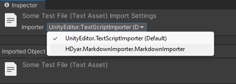

# Unity Markdown Importer
Parse Frontmatter data from Markdown files in Unity. This custom importer creates a "Markdown Object" asset, which has a GetFrontmatter<T>() function for reading the data. The body text is left in a TextAsset to be read and used as normal.

## Why Does This Exist

I don't think markdown is a great tool for game data, but I do think that there are some excellent plaintext tools for authoring things like dialogue or narrative engines, such as [Ink](https://www.inklestudios.com/ink/). This effort, I hope, can continue to work with other tools. The body text of the markdown is imported as a TextAsset (just like a normal markdown file), so we can now combine frontmatter metadata with other plaintext data types for increased flexibility in our systems.

## How To Use

### 1. Create Frontmatter Type

Create a class that is [Serializable] and implements IFrontmatter, which is an empty interface for convenience. The class should have public fields that match the names of the frontmatter:

  ```c#
[Serializable]
public class BlogPostFrontmatter : IFrontmatter
{
    public string title;
    public bool draft;
	public int weight;
}
  ```

### 2. Select Importer

Next, select the text asset for your markdown file (".md" or ".markdown" extensions recognized by default). ".md" files are handled as TextAssets by default, so change the "importer" dropdown to use the markdown importer.


### 3. Select Frontmatter Type 

All classes that extend from IFrontmatter will be listed in the dropdown. Choose the appropriate one (you probably need to create this) and click "Apply". Look at the imported object settings to see if it has serialized correctly.


### Runtime Usage

```C#
using HDyar.MarkdownImporter;
public class Test : MonoBehaviour
{
	public MarkdownObject markdown;
	void Start()
	{
		BlogPostFrontmatter data = markdown.GetFrontmatter<BlogPostFrontmatter>();
		Debug.Log("The title is " + data.title);
	}
}
```

Reference an asset with the type "MarkdownObject", and get frontmatter data with the "GetFrontmatter" function. We have to specify the correct type here. Although the serialized object keeps a reference to this type, I want runtime code not to use janky assembly reflection setup. We get to keep our type safety and nice autocompletes this way. Since the "janky" code is only editor-side, I think it's a good-enough solution.

## Limitations

Types are serialized as strings, so one can't have two frontmatter types with the same name (ie: in different namespaces).

Frontmatter MUST use three hyphens on the first line, and at the end of the frontmatter. This is standard. 

The biggest limitation is the YAML parser. I quickly put together a simple one. It can only handle single lines of  "key: value". It breaks easily, doesn't support arrays or subobjects, and isn't even close to full "[YAML](https://yaml.org/)" spec. Unity saves scene files in it's own flavor of YAML. There is an extremely competent YAML parser built into the tool we are using. So this effort feels silly - I'm reluctant to actually dig in and write my own proper YAMLUtility class. Unfortunately, Unity's parser doesn't appear to be exposed. 

> One hacky workaround would be to create a prefab asset and inject the parsing yaml into it this pretend file, then read the frontmatter front that after Unity's internal systems parse it. This also feels silly.
>
> Another less hacky workaround is to use [YAMLDotNet](https://github.com/aaubry/YamlDotNet) or similar other tool. I don't need full YAML specifications for the project I made this for, so I am not bothering.

In many versions of Markdown, you can use a JSON object for frontmatter. This is not supported.
